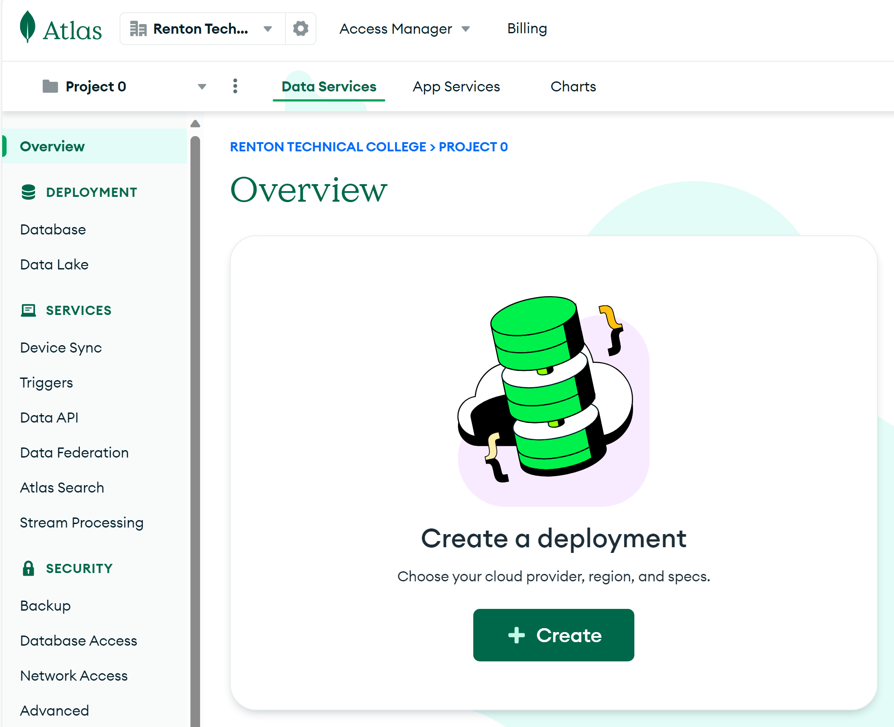
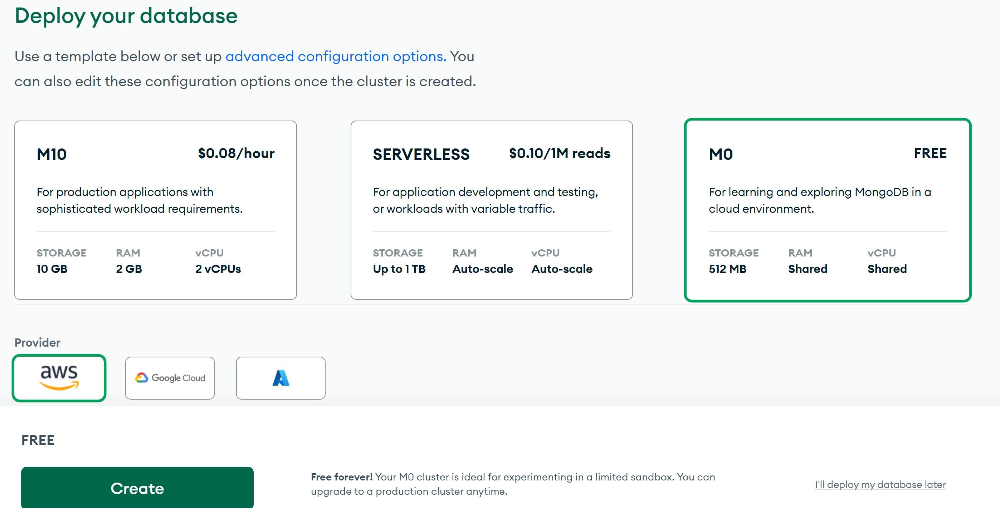
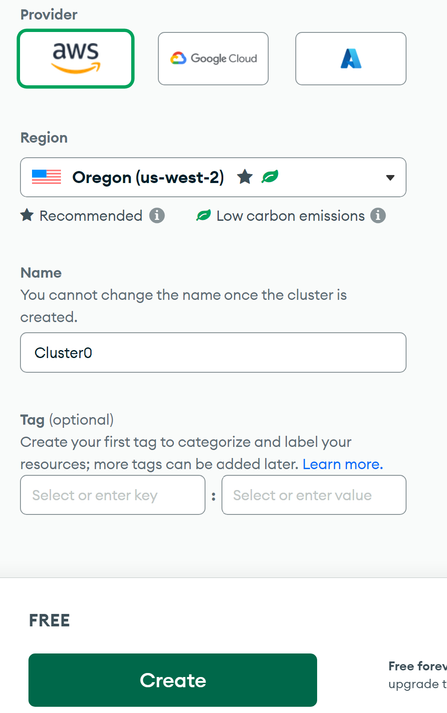
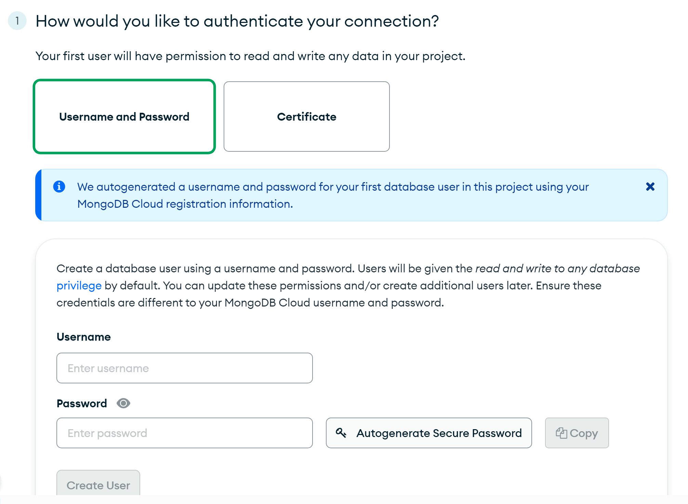
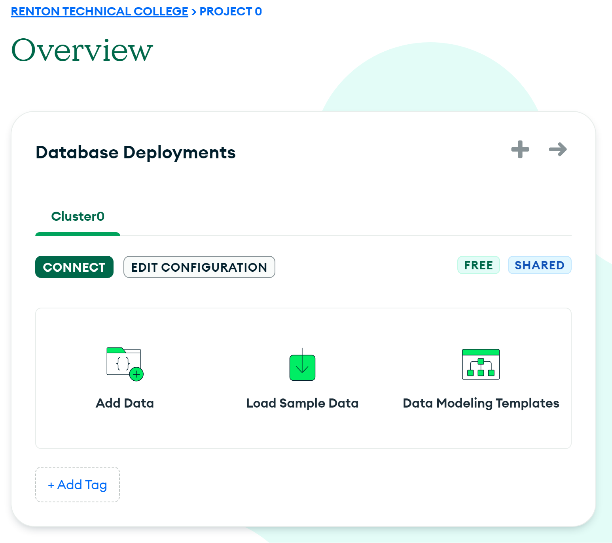
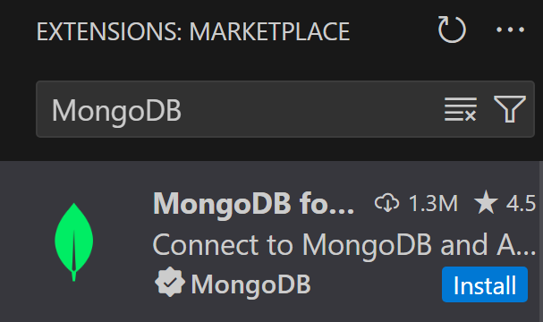
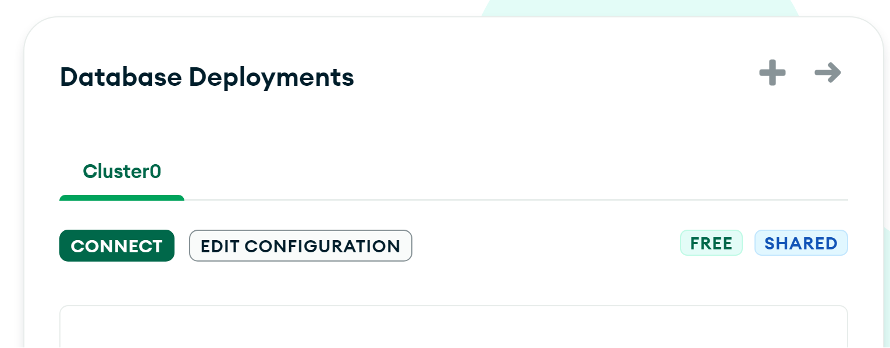
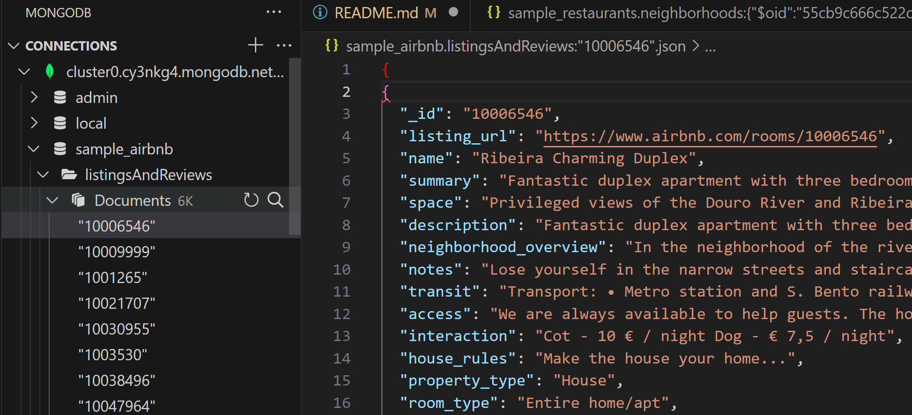

# Renton Technical College CSI-244
<br />    

<div align="center">  
    
    <h3 align="center">Guided Activity 5</h3>
</div>

This repository is a part of CSI-244 at Renton Technical College.

Part 1 of this repository is based on the following Youtube Tutorial.
You are welcome to follow along with this video if you would like
https://youtu.be/xrc7dIO_tXk?si=LkkArlxPamLZWib2

## Guided Activity 5 MongoDB
1. Clone this repository to your machine.
2. Open the repository in Visual Studio code.

### Part 1 - Create a MongoDB Atlas Account
MongoDB Atlas is a cloud-based database service that allows you to store and retrieve data from a MongoDB database. In this part of the activity, you will create a MongoDB Atlas account and create a new cluster.

1. Open a web browser and navigate to the following URL:
    [https://www.mongodb.com/](https://www.mongodb.com/)
2. Click on the "Try Free" button in the upper right-hand corner of the page.
3. Fill out the form to create a new account.
4. Once you have created your account, you will need to verify your email address.
5. Once you have verified your email address, you will be able to log into your account.

### Part 2 - Create a New Cluster
1. Once you have logged into your account, you will be taken to the MongoDB Atlas dashboard.
2. Click the Create Button to create a new cluster.



3. Select the free tier option, AWS as the cloud provider.



4. Select the region closest to you and click the Create Cluster button.



5. Choose a username and password for your database and click the Create User button.



6. Choose the option to connect from my local environment and click the add my current IP address button.
7. Click the finish and close button.
8. You should now see your deployed cluster in the Overview tab.
9. If you lose this tab and need to get back to it, you can click Home, Projects, and then the name of your project. The default is "Project0".



10. Click Load Sample Data to load some sample data into your cluster.
11. We are now ready to connect to our cluster and run some queries.

### Part 2 - Connect to your Cluster from Visual Studio Code Extension

1. Open Visual Studio Code and open the folder for this repository.
2. Click on the Extensions icon in the left hand menu.
3. Search for and install the MongoDB for VS Code extension.



4. Once the extension is installed you will see a new leaf icon in the left hand menu for MongoDB.
5. Click on the MongoDB icon and then click on Add Connection, and then Connection String.
6. You will need to get your connection string from the MongoDB Atlas website.
7. Go back to the MongoDB Atlas website and click on the connect button for your cluster.



8. Click the option to connect via Visual Studio Code.
9. The connection string will be displayed. Click the copy button to copy the connection string to your clipboard.
10. You need to replace the `<password>` in the connection string with the password you created for your database.
11. Go back to Visual Studio Code and paste the connection string into the connection string box.
12. Once you have pasted the connection string into the box, press enter to confirm.
13. You should now be connected to your MongoDB Atlas cluster with the sample data loaded.



14. Click on the cluster and then the sample_airbnb database to see the collections in the database.
15. There is a listingAndReviews collection that we will be using for the next part of the activity.
16. Click on the listingAndReviews collection to see the data in the collection.
17. Click on the Documents and then the first document to see the data in the document.
18. Notice how similar the data is to a JSON object.

### Part 3 - Create a Node.js Application to Connect to MongoDB

1. Open a terminal in Visual Studio Code and navigate to the folder for this repository.
2. Run the following command to create a new Node.js application with server.js as the entry point.
    ```powershell
    mkdir server
    cd server
    npm init
    ```
3. Run the following command to install the MongoDB driver for Node.js and nodemon.
    ```powershell
    npm install mongodb
    npm install nodemon --save-dev
    ```
4. Create a new file in the root of the project called server.js.
5. When connecting to any database from an application your connection string should be stored in an environment variable. This is to prevent your connection string from being exposed in your code. We will use the dotenv package to store our connection string in an environment variable.
6. Run the following command to install the dotenv package.
    ```powershell
    npm install dotenv
    ```
7. Create a new file in the root of the project called .env.
    ```powershell
    new-item .env
    ```
8. Add the following line to the .env file and replace the connection string with your connection string. DO NOT PUT QUOTES AROUND THE CONNECTION STRING.
    ```powershell
    CONNECTION_STRING=your-connection-string
    ```
9. Edit package.json to add a start script that will run the server.js file.
    ```json
    "scripts": {
        "start": "node server.js",
        "dev": "nodemon server.js"
    },
    ```
10. Add the following code to the server.js file.
    ```javascript
      const { MongoClient } = require("mongodb");
      require("dotenv").config();
      //get the connection string from the .env file
      const CONNECTION_STRING = process.env.CONNECTION_STRING;
      // create a new MongoClient
      const client = new MongoClient(CONNECTION_STRING);
      // connect to the database
      try {
        client.connect();
        console.log("Connected to the database");
      } 
      catch (e) {
        console.error(e);
      }
    ```
10. Run the following command to start the server.
    ```powershell
    npm run dev
    ```
11. You should see the message "Connected to the database" in the terminal.
12. Lets run some querys on the air bnb sample data
    ```javascript
    // lets access the sample_airbnb database
    const db = client.db("sample_airbnb");
    const collection = db.collection("listingsAndReviews");

    // lets find all the listings that have a review score of 100
    const query = { "review_scores.review_scores_rating": 100 };
    const cursor = collection.find(query);
    // print the results
    cursor.forEach(
      function(doc) {
        console.log(doc.name);
      },
      function(err) {
        client.close();
      }
    );
    ```
13. You should see the names of the listings that have a review score of 100 in the terminal.
14. Lets also filter by the property type
    ```javascript
    // lets find all the listings that have a review score of 100 and are a house
    const query2 = { "review_scores.review_scores_rating": 100, "property_type": "House" };
    const cursor2 = collection.find(query2);
    // print the results
    cursor2.forEach(
      function(doc) {
        console.log(doc.name);
      },
      function(err) {
        client.close();
      }
    );
    ```
15. You should see the names of the listings that have a review score of 100 and are a house in the terminal.
16. You can now run any query you want on the sample data.
17. Explore the sample data and try running some different queries.
18. Create a query that finds all the listings that have a review score of 100 and are in Sydney.
19. Instead of outputting the names of the listings, output the url where the listing is located.
18. Create a new commit with the message Guided Activity 5 Complete and push the changes to GitHub.


If you have any questions about this assignment please reach out to myself or our TA for this course.
